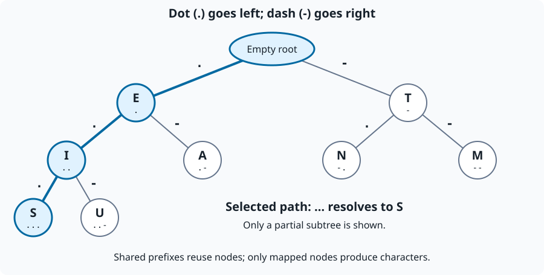

# Morse Tree Decoder

A C17 command-line Morse decoder built around a file-backed binary trie. Dots
select left children, dashes select right children, and a standalone `/` separates
words. The project preserves the educational algorithm from Lucas Paulo Martins
Mariz's 2019 data structures assignment at UFMG while modernizing its organization,
validation, documentation, and tests.

The bundled table supports uppercase `A-Z` and digits `0-9`, following
[ITU-R M.1677-1, Annex 1](https://www.itu.int/dms_pubrec/itu-r/rec/m/R-REC-M.1677-1-200910-I!!PDF-E.pdf).
This is a text decoder, not an encoder or an audio tool; lowercase, accents,
punctuation, and longer custom codes are outside its scope.

## Build and run

The application requires a C17 compiler (GCC or Clang) and GNU Make, with no
third-party runtime dependencies. Run these commands from the repository root:

```sh
make
./morse < examples/sample.in
```

The [sample input](examples/sample.in) is:

<!-- example: sample-input -->
```text
... --- ... / .... . .-.. .--.
```

Output, including a final newline:

<!-- example: sample-output -->
```text
SOS HELP
```

Additional commands:

```sh
./morse -a < examples/sample.in
./morse --print-tree < examples/sample.in
./morse --help
```

`-a` and `--print-tree` append mapped nodes in preorder (root, left, right), one
`symbol code` record per line, after the decoded messages. With empty input,
they print only the tree. `--help` does not read input or open the mapping file.

The default table is [data/morse.txt](data/morse.txt), resolved relative to the
working directory. There is no automatic executable-relative search or `--table`
option. See the [decoding contract](docs/decoding-contract.md) for the table format
and compile-time path override.

## Input and validation

Each physical input line is decoded separately. Spaces and tabs delimit codes;
each standalone `/` emits exactly one space, including leading, trailing, and
repeated separators. LF, CRLF, and a final line without a newline are accepted.
Blank or whitespace-only lines produce blank output lines; empty input emits
nothing. Buffers grow dynamically rather than splitting long lines into chunks.

Unknown codes, attached separators such as `.../---`, unsupported bytes, malformed
or duplicate mapping records, unknown arguments, and allocation/I/O failures produce
English diagnostics on standard error and a nonzero exit status. An invalid line
is omitted, along with the optional tree, but earlier valid lines may already have
been printed. Successfully decoded lines always end with one LF.

The [contract](docs/decoding-contract.md) documents exact whitespace, ownership,
failure, and compatibility rules.

## How it works

1. Read and validate the text mapping, then insert each symbol by following its
   dot-left/dash-right path from the empty root. Shared prefixes reuse nodes.
2. Read a complete message line, look up each token using the same traversal,
   and print the result only after the whole line has been validated.



This partial diagram illustrates the corrected table, not the complete alphabet.
The highlighted path decodes `...` to `S`. Empty nodes do not represent characters.

Building the trie costs `O(sum |code|)`; reading and validating the mapping file
also costs `O(B)`, where `B` is its byte length. Looking up a `k`-signal token costs
`O(k)`. Decoding an `n`-byte message is `O(n)` for the fixed alphabet. The bundled
tree is constant-sized; during decoding, retained buffers use `O(L)` space, where
`L` is the longest physical input line encountered, not the size of the whole file.
These are theoretical bounds, not measured timing or speedup claims.

## Historical evidence and results

The [original five-page report](docs/original-report-2019.pdf) describes the 2019
assignment, its two-stage trie solution, the GCC 7.4/Ubuntu 18.04 environment,
preorder output, and theoretical complexity. It is preserved byte-for-byte in
its original language. It contains one literal input example, but no enumerated
test suite, recorded expected output for that example, or benchmark measurements.

The report's exact input on page 3 is preserved unchanged:

<!-- example: report-input -->
```text
--- ... / -. . - --- ... / --.- .. .
```

Both outputs below were reproduced during modernization, not recorded in the PDF:

| Implementation | Decoded output | Final newline |
| --- | --- | --- |
| Original baseline, commit `96d7bf0` | `OS MEDOS QUE` | No |
| Corrected international mappings | `OS NETOS QIE` | Yes |

The literal tokens decode to `QIE` under the corrected table; they have not been
edited to force `QUE`. The original table contained nine incorrect letter mappings
(`A`, `D`, `F`, `G`, `I`, `M`, `N`, `T`, `U`). The
[correction table](docs/decoding-contract.md#historical-evidence-and-deliberate-corrections)
and [historical fixtures](tests/fixtures/historical/README.md) document the changes.
Missing final newlines, joined message/tree output, ignored arguments, fixed-size
chunks, and unsafe error paths were deliberately corrected.

The [extended historical tree image](docs/figures/morse-tree.png) is also unchanged.
It shows extra symbols outside the application's scope and is not an exact rendering
of the original buggy table. Its external provenance/license is not stated in the
original repository or report; no new attribution or license is assumed.

### Modern verification

The complete suite passes locally with GCC 13.3 and Clang 18.1.3. Expected mappings
are handwritten independently of the active table, and CLI comparisons check exact
bytes, including final newlines. The README sample and literal report input are
checked by the integration suite.

| Suite or measurement | Verified result |
| --- | --- |
| Module checks | 359 passed |
| Exhaustive checks | 10,310 passed: all 62 nonempty codes of length 1-5 and 2,592 ordered-pair/separator cases |
| Fault-injection checks | 2,296 passed, including failures at each of 49 allocation occurrences |
| CLI cases | 77 passed on Linux, including `/dev/full` |
| Application coverage (GCC/gcov) | 100% lines, branches, and functions: 290 executable lines, 242 branches, 24 functions |
| Memory/runtime checks | AddressSanitizer, UBSan, and LeakSanitizer passed |
| Quality checks | GCC static analysis and clang-format 18 passed |

Fault tests cover allocation cleanup, open/read/write/close/flush errors, long-line
growth, and partial-output rules. Exhaustiveness applies to the stated finite
domains, not every possible unbounded string; coverage is not a proof of correctness.
These are present-day automated results, not historical benchmarks or hosted CI status.

## Development and CI

Tests require a glibc/POSIX host, a GNU-compatible linker, a POSIX shell, `awk`,
`timeout`, GNU-compatible `head`, and standard command-line tools. glibc custom
streams and linker wrapping are test-only dependencies. Coverage and static analysis
require GCC/gcov; formatting uses clang-format 18.

| Command | Purpose |
| --- | --- |
| `make test` | Module, exhaustive, fault-injection, and exact-byte CLI tests |
| `make sanitize` | The same suite with AddressSanitizer and UBSan |
| `make sanitize ASAN_OPTIONS=detect_leaks=1` | Enable leak checks on a compatible host |
| `make coverage` | Run instrumented tests and print gcov coverage |
| `make analyze` | Compile with the GCC static analyzer |
| `make format` | Format C source and headers |
| `make check-format` | Check formatting without modifying files |
| `make clean` | Remove only known generated profiles and executable |

Build profiles are isolated under `build/`; compiler/flag changes invalidate the
corresponding objects. Use `make CC=clang-18 test` for Clang and
`make CLANG_FORMAT=clang-format-18 check-format` for a versioned formatter.
Local leak detection defaults to disabled because traced/sandboxed environments
can be incompatible with LeakSanitizer; CI enables it.

The [GitHub Actions workflow](.github/workflows/ci.yml) runs GCC/Clang tests,
sanitizers with leak detection, formatting, static analysis, and coverage on pushes,
pull requests, and manual dispatch. Every job and step has an explicit timeout.
Repository permissions are read-only, checkout is pinned by SHA, and credentials
are not persisted. A hosted run must be confirmed separately from local results.

## Project layout

```text
Makefile              Root build and development commands
include/              Public module interfaces
src/                  Entry point, application, trie, table, decoder, and text I/O
data/                 Active alphanumeric mapping
examples/             Runnable input
tests/                Unit, exhaustive, failure, CLI, and historical fixtures
docs/                 Decoding contract, original report, and diagrams
.github/workflows/    Bounded continuous integration
```
